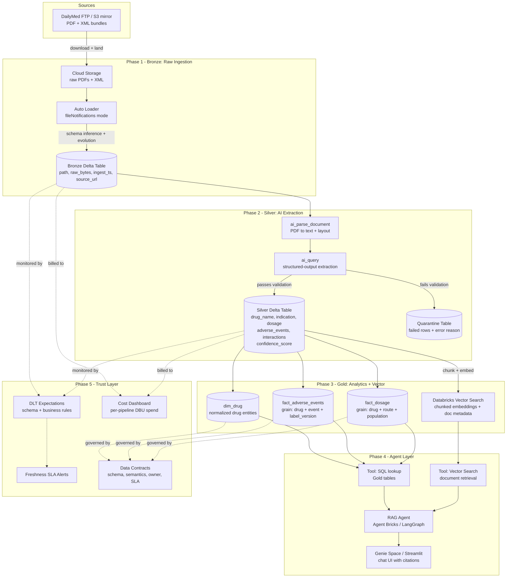

# Clinical Document Intelligence Platform

A production-grade Databricks lakehouse pipeline that ingests unstructured clinical and regulatory documents, extracts structured fields with LLMs, and exposes them to BI and an AI agent — with full governance, observability, and cost tracking.

---

## North Star Questions

These are the questions an end user (medical affairs analyst, regulatory scientist, safety officer) should be able to answer in under 30 seconds:

1. **"What are all the known drug interactions for [compound], and which label sections mention them?"**
2. **"Across all FDA-approved oncology drugs in our corpus, what adverse events appear in more than 30% of labels?"**
3. **"Show me every label where the recommended dosage changed between versions, with the exact before/after text."**
4. **"Which drugs share the same mechanism of action as [compound] and have a similar side-effect profile?"**

---

## Dataset

**FDA Drug Labels via DailyMed** — [https://dailymed.nlm.nih.gov/dailymed/](https://dailymed.nlm.nih.gov/dailymed/)

| Property | Detail |
|---|---|
| Format | PDF + structured XML (SPL) |
| Volume | ~140,000 active labels; we use a curated oncology slice (~5,000 labels) |
| Ground truth | SPL XML provides machine-readable structured fields for evaluation |
| License | Public domain (US federal government) |
| PHI risk | Zero — all synthetic/regulatory content |
| Domain relevance | Directly mirrors Exact Sciences' regulatory and clinical documentation challenges |

Why this dataset over alternatives:
- **PubMed abstracts**: text-only, no PDF parsing challenge, no structured ground truth at field level
- **MIMIC-IV notes**: PHI scrubbing adds compliance overhead even for de-identified data; not suitable for a portfolio project
- **FDA Drug Labels**: real PDFs with known-good structured answers, zero compliance risk, domain-relevant

---

## Architecture

> **Viewing tip:** This diagram renders natively on GitHub. In VS Code, install the
> [Markdown Preview Mermaid Support](https://marketplace.visualstudio.com/items?itemName=bierner.markdown-mermaid)
> extension and use **Cmd+Shift+V** to open the preview.



---

## Tech Stack

| Layer | Technology |
|---|---|
| Compute & orchestration | Databricks (Unity Catalog, Lakeflow Jobs, DLT) |
| Storage | Delta Lake on cloud object storage (S3/ADLS) |
| Ingestion | Auto Loader (fileNotifications mode) |
| AI extraction | `ai_parse_document`, `ai_query` (Databricks AI Functions) |
| Embeddings + search | Databricks Vector Search |
| Agent framework | Agent Bricks (Mosaic AI) or LangGraph |
| BI / chat | Genie Space or Streamlit |
| Governance | Unity Catalog tags, lineage, data contracts |
| Observability | DLT expectations, system tables, Databricks Jobs alerts |
| Language | Python 3.11, PySpark, SQL |
| CI | GitHub Actions (linting, unit tests, contract validation) |

---

## Repository Structure

```
data-document-intelligence-platform/
├── README.md                        ← this file
├── architecture/
│   ├── architecture.md              ← detailed design decisions + trade-offs
│   └── data-contract-template.md   ← reusable contract schema
├── data/
│   └── sample/                     ← small fixtures for local testing
├── phase1_bronze/
│   ├── notebooks/                  ← Auto Loader ingestion notebook
│   └── jobs/                       ← Lakeflow Job YAML definitions
├── phase2_silver/
│   ├── notebooks/                  ← AI extraction notebook
│   └── prompts/                    ← versioned extraction prompts
├── phase3_gold/
│   ├── notebooks/                  ← dimensional model + embedding notebooks
│   └── vector/                     ← Vector Search index config
├── phase4_agent/
│   ├── agent/                      ← RAG agent code + tool definitions
│   └── app/                        ← Streamlit UI
├── phase5_trust/
│   ├── expectations/               ← DLT / Great Expectations rules
│   ├── contracts/                  ← one contract per Gold table
│   └── dashboards/                 ← cost + health dashboard notebooks
├── phase6_story/                   ← writeup, video script, blog post
├── src/
│   ├── ingestion/                  ← reusable ingestion helpers
│   ├── extraction/                 ← LLM extraction utilities
│   ├── agent/                      ← agent tools and chains
│   └── utils/                      ← shared utilities
├── tests/                          ← unit + integration tests
├── docs/                           ← additional documentation
└── .github/workflows/              ← CI pipelines
```

---

## Phase Tracker

| Phase | Scope | Status |
|---|---|---|
| 0 — Setup | Repo, architecture, dataset | **Done** |
| 1 — Bronze | Auto Loader ingestion | **Done** |
| 2 — Silver | AI extraction + quarantine | **Done** |
| 3 — Gold | Analytics tables + vector index | **Done** |
| 4 — Agent | RAG agent + chat UI | **Done** |
| 5 — Trust | Expectations, SLAs, cost dashboard | **Done** |
| 6 — Story | README, video, writeup | Not started |

---

## Key Design Decisions

**Why Unity Catalog from day one?**
Column-level lineage and fine-grained access control are free in UC. Retrofitting them later is painful. Starting with UC means every table, column, and embedding index has an owner, SLA, and audit trail from the first write.

**Why ai_query over a custom LLM API call?**
`ai_query` keeps inference inside the Databricks security perimeter, charges to the same DBU cost dashboard, and supports structured output natively. For a regulated industry portfolio project, keeping data inside the perimeter is the right default.

**Why separate Bronze / Silver / Gold instead of one big pipeline?**
Each layer has a different failure mode and reprocessing cost. Bronze is cheap to re-ingest. Silver (LLM calls) is expensive — we want to quarantine bad rows rather than fail the whole batch. Gold is a pure transformation and should be idempotent and fast.

**Why chunk at Gold, not Silver?**
Silver extraction gives us clean structured fields. Chunking at Gold means we can chunk the *clean* text, attach structured metadata (drug name, label section, version), and produce higher-quality retrieval contexts for the agent.
