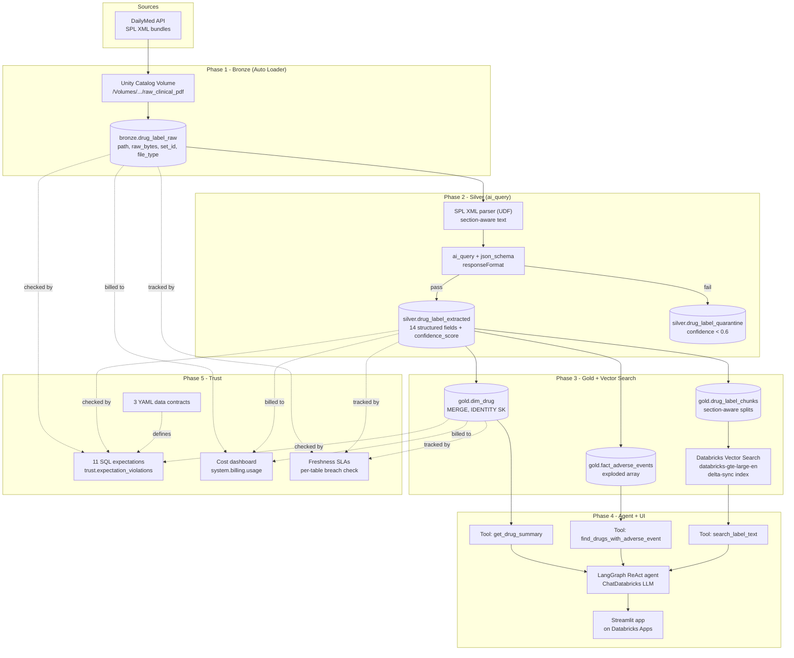

# Clinical Document Intelligence Platform

> A production-grade Databricks lakehouse that turns thousands of unstructured FDA drug labels into a queryable, AI-augmented knowledge base — with full data contracts, observability, and cost tracking.

```
PDF/XML labels → Bronze raw bytes → Silver AI-extracted fields →
   Gold dim/fact + Vector Search → RAG agent that cites its sources
```

---

## What you can do with it

Ask plain-English questions across thousands of FDA labels and get answers grounded in cited label text:

| Question | Tool the agent picks | Returns |
|---|---|---|
| *"What is pembrolizumab approved to treat?"* | `get_drug_summary` (SQL) | structured row from `gold.dim_drug` |
| *"Which drugs list pneumonitis as an adverse event?"* | `find_drugs_with_adverse_event` (SQL) | join across `dim_drug` + `fact_adverse_events` |
| *"What does the label say about renal dosing in elderly patients?"* | `search_label_text` (Vector Search) | top-5 chunks with drug + section citation |
| *"Find drugs that share a cardiovascular adverse event AND treat lung cancer"* | **chained SQL + Vector** | structured filter then prose evidence |

The agent always ends with a `Sources: <drug> — <section>` citation footer.

---

## Architecture

> **Viewing tip:** This renders natively on GitHub. In VS Code, install the [Markdown Preview Mermaid Support](https://marketplace.visualstudio.com/items?itemName=bierner.markdown-mermaid) extension.



---

## Tech stack

| Layer | What we use |
|---|---|
| **Storage** | Delta Lake on Unity Catalog Volumes |
| **Ingestion** | Auto Loader (`binaryFile` format) |
| **Extraction** | `ai_query` with structured `responseFormat` (Llama 3.3 70B) |
| **Embeddings + retrieval** | Databricks Vector Search, `databricks-gte-large-en` |
| **Agent** | LangGraph ReAct + `ChatDatabricks` |
| **UI** | Streamlit on Databricks Apps |
| **Governance** | Unity Catalog tags + YAML data contracts |
| **Observability** | SQL expectation framework + `system.billing.usage` |
| **Orchestration** | Lakeflow Jobs (cron, file arrival, or manual trigger) |
| **Language** | Python 3.11, PySpark, SQL |

---

## How it's organised

| Folder | Phase | What's in it |
|---|---|---|
| [phase1_bronze](phase1_bronze) | Bronze | Auto Loader notebook + Lakeflow Job |
| [phase2_silver](phase2_silver) | Silver | SPL parser UDF + `ai_query` extraction + versioned prompt |
| [phase3_gold](phase3_gold) | Gold | `dim_drug` MERGE, fact build, chunker, Vector Search index |
| [phase4_agent](phase4_agent) | Agent | LangGraph tools + Streamlit chat app |
| [phase5_trust](phase5_trust) | Trust | Contracts, expectations, quality + cost dashboards |
| [phase6_story](phase6_story) | Story | Walkthrough script, blog post, results writeup |
| [architecture](architecture) | — | Detailed design doc with full DDL + cost model |
| [src/ingestion](src/ingestion) | — | Local Python: DailyMed downloader |
| [src/agent](src/agent) | — | Agent code (importable from notebooks and the app) |

---

## Phase tracker

| Phase | Scope | Status |
|---|---|---|
| 0 — Setup | Repo, architecture, dataset choice | ✅ Done |
| 1 — Bronze | Auto Loader ingestion → `bronze.drug_label_raw` | ✅ Done |
| 2 — Silver | SPL XML → `ai_query` → `silver.drug_label_extracted` | ✅ Done |
| 3 — Gold | `dim_drug`, `fact_adverse_events`, chunks + Vector Search | ✅ Done |
| 4 — Agent | LangGraph RAG agent + Streamlit chat UI | ✅ Done |
| 5 — Trust | 3 contracts, 11 expectations, cost + freshness dashboards | ✅ Done |
| 6 — Story | [README](README.md), [walkthrough script](phase6_story/video_walkthrough.md), [blog post](phase6_story/blog_post.md), [results](phase6_story/results.md) | ✅ Done |

---

## Three design decisions worth calling out

**1. We never use `ai_parse_document`.** DailyMed bulk downloads contain XML, not PDF. SPL XML is structured, noisy, and verbose — which is actually a stronger extraction demo than PDF parsing because we have ground truth tagged inside the source. The trade-off: we can't claim a "PDF parsing" demo, but extraction quality is higher and reruns are free.

**2. Tools take an injected SQL runner.** [phase4_agent/agent/tools.py](phase4_agent/agent/tools.py) accepts either `make_spark_sql_runner(spark)` (notebook context) or `make_sdk_sql_runner(workspace_client, warehouse_id)` (Streamlit app context). One agent codebase, two runtime environments, zero duplication.

**3. The trust layer is its own pipeline, not a side effect.** [Phase 5](phase5_trust) has dedicated tables (`trust.expectation_violations`, `trust.expectation_runs`), dedicated dashboards, and its own daily Lakeflow Job that fails hard on error-severity violations. Most portfolio projects skip this. It's the senior differentiator.

For the full design rationale see [architecture/architecture.md](architecture/architecture.md).

---

## How to reproduce

**1. Acquire data (local Python script)**
```bash
export DATABRICKS_HOST=https://<your-workspace>.cloud.databricks.com
export DATABRICKS_TOKEN=<pat>
python3 src/ingestion/download_dailymed.py \
  --output-dir /Volumes/clinical-lab/default/raw_clinical_pdf \
  --limit 50
```

**2. Run setup notebooks once, in order**
```
phase1_bronze/notebooks/00_setup.py
phase2_silver/notebooks/00_setup_silver.py
phase3_gold/notebooks/00_setup_gold.py
phase5_trust/expectations/00_setup_checks.py
```

**3. One-time UI step:** create a Vector Search endpoint named `clinical_docs_vs` (Compute → Vector Search → Create endpoint).

**4. Run the pipeline notebooks** (or `databricks bundle deploy` then `bundle run`):
```
phase1_bronze/notebooks/01_ingest_bronze.py
phase2_silver/notebooks/01_extract_silver.py
phase3_gold/notebooks/01_build_gold.py
phase3_gold/notebooks/02_chunk_text.py
phase3_gold/notebooks/03_vector_index.py
phase5_trust/expectations/01_run_expectations.py
```

**5. Test the agent**
- In a notebook: [phase4_agent/notebooks/01_test_agent.py](phase4_agent/notebooks/01_test_agent.py)
- As an app: deploy [phase4_agent/app/](phase4_agent/app/) via **Compute → Apps → Create app**

---

## Cost (50–100 oncology labels, dev scale)

| Stage | Per run | Why |
|---|---|---|
| Bronze ingestion | < $0.10 | Auto Loader on a small Photon cluster |
| Silver extraction | ~$0.50 | 50 labels × ~$0.01 of `ai_query` each |
| Gold build + chunks | < $0.10 | Pure Spark transforms |
| Vector Search (initial) | ~$0.10 | Embedding ~150 chunks once |
| Vector Search (steady) | ~$60/month | Hosted index, always-on |
| Trust checks | < $0.05 | SQL aggregations |
| **Total to demo** | **~$1** | Excluding ongoing VS endpoint |

Scales linearly to ~$100 one-time + ~$150/month at 5,000 labels. Full breakdown in [architecture/architecture.md](architecture/architecture.md).

---

## What I'd do differently with another month

- **MERGE for fact tables instead of TRUNCATE+INSERT** — would let us track adverse-event history per label version instead of overwriting it.
- **Add a `fact_dosage` table** — currently dosage stays as free text in Silver. Would need another `ai_query` pass to parse route/population/frequency.
- **Replace the SQL runner with a proper SQL agent tool** that generates queries against a semantic layer instead of three hand-built tools.
- **Move trust checks to Lakehouse Monitoring** — the SQL framework here works but Lakehouse Monitoring would auto-detect drift on top.

---

## Repository structure

```
data-document-intelligence-platform/
├── README.md                       ← you are here
├── databricks.yml                  ← Databricks Asset Bundle config
├── architecture/
│   ├── architecture.md             ← full design with DDL + cost model
│   └── data-contract-template.md   ← reusable contract template
├── phase1_bronze/                  ← Auto Loader + Bronze DDL
├── phase2_silver/                  ← SPL parser + ai_query extraction
├── phase3_gold/                    ← dim/fact + chunking + Vector Search
├── phase4_agent/                   ← LangGraph agent + Streamlit app
├── phase5_trust/                   ← Contracts, expectations, dashboards
├── phase6_story/                   ← Walkthrough script + blog post
├── src/                            ← Local Python: DailyMed downloader, agent core
├── tests/
└── .github/workflows/              ← CI skeleton
```
